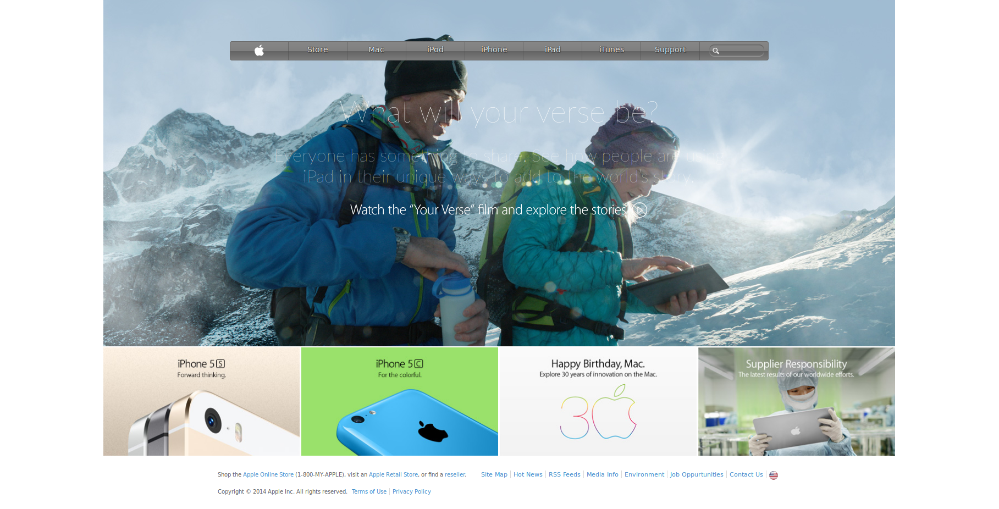

# Appleclone.io
# Microverse Solo Curriculum

This is my solution to Microverse's first solo project. It is an Apple page clone. It is created using HTML5 and CSS3.

[Live Version](https://rawcdn.githack.com/eduardoreisalvarenga/microverse_apple/59d7cae4d0254b5e513843979e427a1cea5e74af/index.html)

Project contributors:

- Eduardo Reis

## Screenshots

### Screenshot 1

